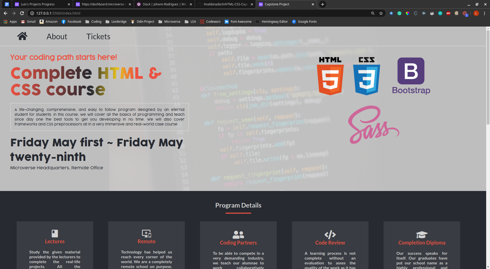

# HTML & CSS Capstone Project! An Original Website

> In this project, I used all the knowledge acquired throughout the HTML & CSS section. I used background images, gradients, flexbox, grids, input tags, links, anchor tags, semantic HTML, transitions, media queries, the Sass preprocessor, amongst many other tools I learned during this section of the main curriculum.




I created a unique website using all the tools learned during the HTML & CSS section. It is fully responsive, from the smallest smartphone to a large widescreen. The topic I chose for my project is about a course much like the one Microverse offers since I honestly believe is the best one out there.

## Live version

[Live Version](https://rawcdn.githack.com/lmaldonadoch/HTML-CSS-Capstone/998db4376c8aaebbb42587b026b43b38c7f9e6cc/index.html)

## Built With

- Bootstrap
- HTML
- CSS
- Google fonts
- Font Awesome
- Sass
- [Cyndy's Shin design](https://www.behance.net/gallery/29845175/CC-Global-Summit-2015)

## Getting Started

To get a local copy of the repository please run the following commands on your terminal:

```
$ cd <folder>
```

```
$ git clone git@github.com:lmaldonadoch/HTML-CSS-Capstone.git
```

## Author

👤 **Luis Angel Maldonado**

- Github: [@lmaldonadoch](https://github.com/lmaldonadoch)
- Twitter: [@LuisAngelMCh](https://twitter.com/LuisAngelMCh)
- LinkedIn: [lmaldonadoch](https://www.linkedin.com/in/luis-angel-maldonado-5b503a1a3/)

## 🤝 Contributing

Contributions, issues and feature requests are welcome!

Feel free to check the [issues page](https://github.com/lmaldonadoch/HTML-CSS-Capstone/issues).

## Show your support

Give a ⭐️ if you like this project!

## Acknowledgments

- Project inspired by Microverse Program.
- The layout, colors and inspiration was taken from a design by Cindy Shin. The original design elements and guide can be fount at [Behance](https://www.behance.net/gallery/29845175/CC-Global-Summit-2015) website.
- On this website, there is mention of fictional characters, rights are property of
  CBS® and do not hold any relationship with the project. The use of the
  names and images is solely for educational purposes.
